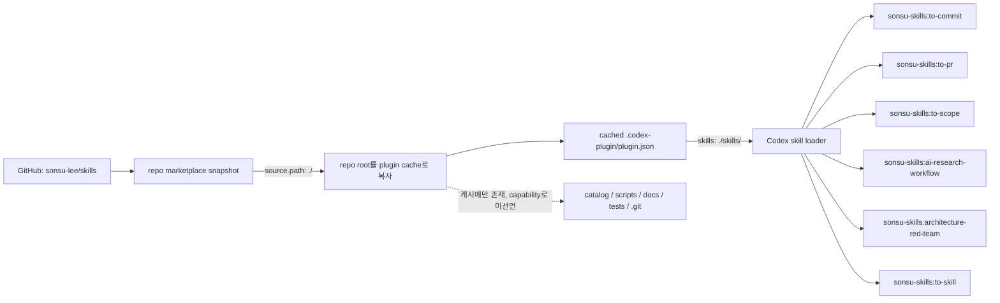

# 개인 스킬 저장소 설계

상태: 기본 설계 승인, Codex plugin과 owned refinement 구현됨

마지막 수정: 2026-07-23

## 목적

이 저장소는 다음 네 영역을 함께 관리한다.

1. 직접 작성하고 유지보수하는 portable 개인 스킬
2. 외부 스킬과 호스트 플러그인의 출처, 분류와 설치 방법을 기록한 카탈로그
3. `npx skills`와 호스트 공식 설치 명령을 호출하는 얇은 설치 도구
4. 개인 스킬 전체를 Codex에 배포하는 `sonsu-skills` 플러그인

외부 스킬 소스는 이 저장소에 복사하거나 미러링하지 않는다. 설치할 때 upstream 저장소, `npx skills` 또는 각 호스트가 제공하는 공식 플러그인을 사용한다.

## 기본 원칙

- `skills/`에는 직접 만든 스킬과 명시적으로 내재화한 스킬만 둔다.
- 외부 스킬은 사용자가 선택한 항목만 카탈로그에 등록한다.
- 외부 파일을 수정하거나 자체 배포본으로 재포장하지 않는다.
- `skills/`를 직접 만든 스킬의 유일한 배포 SSOT로 사용한다.
- 공용 스킬과 호스트 전용 기능을 설치 단계에서 분리한다.
- 설치는 기존 CLI와 호스트의 플러그인 기능을 우선 사용한다.
- 독자적인 패키지 관리자, dependency resolver 또는 동기화 시스템을 만들지 않는다.
- 코드는 꼭 필요한 범위로 제한하고 표준 라이브러리를 우선한다.
- `docs/DESIGN.md`를 현재 설계의 SSOT로 유지한다.

## 저장소 책임과 경계

이 저장소는 별도 플러그인 저장소를 만들지 않고 하나의 공개 번들 플러그인 `sonsu-skills`를 Codex에 제공한다. 플러그인은 `skills/`에 있는 직접 작성·관리 스킬만 capability로 선언하고 노출한다. 외부 catalog 항목은 설치 metadata로만 유지하며 Codex skill이나 다른 plugin capability로 노출하지 않는다.

초기 플러그인은 skills-only다. custom agent, hook, MCP server, app, connector, model routing 설정과 시각 asset은 실제 요구가 생기기 전까지 추가하지 않는다. 외부 공식 플러그인은 계속 catalog provider와 설치 안내로만 다루며 `sonsu-skills`의 일부로 재배포하지 않는다.

Codex manifest는 공식 schema를 따르고 저장소 루트의 `skills/` 원본을 가리킨다. 플러그인을 위한 물리적 스킬 사본은 만들지 않는다. Claude Code native plugin은 이번 배포 범위에 포함하지 않는다.

여기서 플러그인 경계는 물리적 archive 경계가 아니라 runtime 노출 경계다. marketplace가 저장소 루트를 plugin source로 사용하므로 Codex 설치 캐시에는 `catalog/`, `scripts/`, `docs/`, tests와 Git metadata가 함께 복사될 수 있다. 그러나 manifest는 `./skills/`만 skill root로 선언하고 다른 capability를 선언하지 않으므로 이 파일들은 실행되거나 스킬로 탐색되지 않는다. 캐시에도 owned skill 파일만 존재해야 한다는 요구가 생기면 별도 release artifact나 plugin 저장소가 필요하며, 현재 범위에서는 그 복잡도를 도입하지 않는다.

GitHub repo marketplace로 설치할 수 있다는 의미의 공개 배포를 목표로 한다. OpenAI의 공용 Plugins Directory 게시는 별도 심사와 listing 계약이 필요한 다른 작업이며 현재 범위에 포함하지 않는다.

공개 스킬과 배포 전 스킬의 경계를 디렉터리로 보장한다. draft와 내부 전용 스킬은 `skills/`, `.agents/skills/`, `.claude/skills/` 같은 표준 탐색 경로에 두지 않는다.

### 배포와 설치 채널

같은 개인 스킬을 목적이 다른 세 채널로 제공한다.

1. `skills.sh`와 `npx skills`는 `skills/`를 탐색해 개인 스킬을 하나씩 선택하거나 전체 설치한다. 설치한 파일을 소비 프로젝트에서 수정할 수 있는 선택형 채널이다.
2. Codex native plugin은 개인 스킬 전체를 `sonsu-skills`라는 관리형 번들로 설치한다. 일부 스킬만 선택하지 않으며 사용자가 로컬 사본을 직접 관리하지 않는 채널이다. 업데이트는 자동 동기화가 아니라 manifest version 갱신, marketplace refresh와 plugin 재설치 또는 app update를 통해 수행한다. Claude Code에서는 이 채널을 제공하지 않는다.
3. 기존 profile CLI의 목표 역할은 프로젝트 성격에 맞는 개인 스킬과 외부 catalog provider를 조합하는 것이다. 개인 스킬 원본은 계속 `skills/`에 두고 외부 스킬은 upstream 설치 정보만 사용한다.

선택 설치와 전체 번들 설치는 서로 다른 사용 방식이다. profile CLI가 native plugin 전체 설치를 암묵적으로 대신하거나, native plugin이 외부 catalog 항목을 끌어오지 않는다.

같은 Codex 실행 환경에서는 owned skill의 direct 설치와 `sonsu-skills` plugin을 동시에 활성화하지 않는다. direct 설치의 `to-commit`과 plugin의 `sonsu-skills:to-commit`은 이름이 달라 둘 다 로드될 수 있고, 같은 description이 implicit invocation 후보를 중복시키기 때문이다.

- 전체 owned skill을 관리형으로 사용하면 `sonsu-skills` plugin만 활성화한다.
- 프로젝트나 스킬별 선택 설치가 필요하면 plugin을 disable 또는 제거한 뒤 direct 채널을 사용한다.
- Claude Code의 direct 설치와 Codex plugin은 서로 다른 호스트이므로 이 제한의 대상이 아니다.
- 외부 catalog skill은 owned skill과 동일한 배포물이 아니므로 이 규칙으로 일괄 차단하지 않고 항목별 trigger 중복을 검토한다.

native `codex plugin add`는 기존 direct skill을 자동 제거하지 않으며 모든 프로젝트의 repo-scoped skill을 미리 검사할 수도 없다. 설치 안내에서 이 전제조건을 명시하고 사용자가 두 채널을 동시에 선택하지 않게 한다. 현재 profile CLI는 외부 catalog만 설치하므로 충돌하지 않는다. 향후 owned skill 선택 설치를 추가할 때는 공식 plugin 목록에서 활성화된 `sonsu-skills`를 확인하고, 발견하면 파일을 변경하기 전에 오류로 종료한다. 설치 도구가 plugin을 자동으로 disable하거나 direct 사본을 삭제하지 않는다.

현재 여섯 개인 스킬에는 `skills.sh.json`을 추가하지 않는다. 이 파일은 skills.sh 검색 등록의 필수 조건이 아니며, 스킬 수와 카테고리가 더 늘어 별도 분류 metadata가 실제로 필요할 때 다시 검토한다.

### 현재 구현 상태

| 영역 | 상태 | 현재 계약 |
| --- | --- | --- |
| owned skills | 구현됨 | `skills/`의 여섯 스킬이 배포 SSOT다. |
| 외부 catalog와 profile CLI | 구현됨 | 현재 CLI는 catalog의 외부 항목만 조합한다. |
| Codex `sonsu-skills` plugin | 구현됨 | manifest, repo marketplace와 격리 runtime 검증을 제공한다. |
| profile CLI의 owned skill 조합 | 보류 | 별도 schema와 설치 계약을 정한 뒤 후속 작업으로 다룬다. |

### 플러그인 배치와 버전

플러그인 관련 파일은 저장소 루트에 다음처럼 둔다.

```text
skills/                              # owned portable SSOT
.codex-plugin/plugin.json            # Codex bundle manifest, skills ./skills/
.agents/plugins/marketplace.json     # one sonsu-skills entry, source.path ./
catalog/                             # external metadata only
scripts/                             # profile installer
```

Codex manifest는 `./skills/`를 가리킨다. 이 값을 명시하면 plugin의 기본 skill root에 경로를 추가하는 것이 아니라 해당 plugin이 사용할 skill root를 이 경로로 확정한다. repo marketplace의 `sonsu-skills` 항목은 `plugins[].source.source`를 `local`, `plugins[].source.path`를 `./`로 두어 저장소 루트의 `.codex-plugin/plugin.json`을 가리킨다. 이 경로는 `.agents/plugins/`가 아니라 marketplace root인 저장소 루트를 기준으로 해석한다.

#### 고정 인터페이스

| 경계 | 파일과 값 | 소비자 | 보장하거나 실패해야 하는 조건 |
| --- | --- | --- | --- |
| marketplace identity | `.agents/plugins/marketplace.json`의 `name: "sonsu-skills"` | marketplace 등록과 선택 | 이름을 안정적으로 유지한다. |
| marketplace inventory | `plugins`에 `sonsu-skills` 한 항목 | plugin directory | 다른 plugin을 함께 노출하지 않는다. |
| plugin source | `source: { "source": "local", "path": "./" }` | marketplace resolver | 저장소 루트로 해석되며 root 밖 경로는 허용하지 않는다. |
| install policy | `AVAILABLE`, `ON_INSTALL`, `Productivity` | Codex install UI | 공식 marketplace 필드를 명시한다. |
| plugin identity | `.codex-plugin/plugin.json`의 `name: "sonsu-skills"` | plugin installer와 namespace resolver | marketplace entry 이름과 다르면 설치가 실패한다. |
| plugin version | strict semver | plugin cache와 updater | runtime 내용이 바뀌면 반드시 올린다. |
| skill root | `skills: "./skills/"` | plugin loader | 이 경로만 plugin skill root로 사용한다. |
| skills-only surface | manifest에 `apps`, `mcpServers`, `hooks`가 없고 root에 `.app.json`, `.mcp.json`, `hooks/hooks.json`도 없음 | plugin loader의 명시적·기본 탐색 | owned skills 외 capability가 활성화되지 않는다. |
| runtime names | `sonsu-skills:<frontmatter.name>` | skill selector와 명시적 invocation | 현재는 `sonsu-skills:ai-research-workflow`, `sonsu-skills:architecture-red-team`, `sonsu-skills:to-commit`, `sonsu-skills:to-pr`, `sonsu-skills:to-scope`, `sonsu-skills:to-skill`만 노출한다. |
| activation | 설치된 plugin의 enabled 상태 | Codex runtime | enabled일 때 여섯 스킬 전체, disabled일 때 어느 것도 노출하지 않는다. |
| channel exclusivity | Codex direct owned skills와 enabled `sonsu-skills` 중 하나 | 설치 안내와 향후 profile CLI | 두 채널이 함께 활성화된 상태를 지원 구성으로 취급하지 않는다. |

plugin manifest와 marketplace의 현재 계약은 다음 값으로 맞춘다. 공식 schema가 달라지면 최신 계약에 맞춰 함께 수정하되 위 경계는 유지한다.

```json
{
  "name": "sonsu-skills",
  "version": "0.4.0",
  "description": "Personal skills maintained by sonsu-lee.",
  "skills": "./skills/"
}
```

```json
{
  "name": "sonsu-skills",
  "interface": { "displayName": "Sonsu Skills" },
  "plugins": [
    {
      "name": "sonsu-skills",
      "source": { "source": "local", "path": "./" },
      "policy": {
        "installation": "AVAILABLE",
        "authentication": "ON_INSTALL"
      },
      "category": "Productivity"
    }
  ]
}
```

#### 설치와 runtime 노출 흐름



사용 흐름은 다음과 같다.

1. `codex plugin marketplace add sonsu-lee/skills`가 Git marketplace snapshot을 만든다.
2. Codex가 snapshot root의 `.agents/plugins/marketplace.json`을 읽고 `source.path: "./"`를 snapshot root로 해석한다.
3. `codex plugin add sonsu-skills@sonsu-skills`가 marketplace entry와 manifest 이름을 대조하고 저장소 루트를 version별 plugin cache로 복사한다.
4. 새 작업에서 cached manifest가 `./skills/` 하나만 skill root로 넘긴다.
5. loader가 owned skill을 `sonsu-skills:*` namespace로 노출한다. catalog 항목과 다른 저장소 파일은 skill inventory에 들어가지 않는다.
6. plugin을 disable하면 이 plugin의 skill root 전체를 로드하지 않는다.

설치 전에는 같은 Codex 환경에 direct owned skill이 활성화되어 있지 않은지 확인한다. native plugin 명령은 이 충돌을 자동 해결하지 않으므로 plugin 설치 문서와 향후 owned-skill profile CLI가 이 운영 경계를 담당한다.

업데이트는 자동 upstream sync가 아니다. `skills/**` 또는 plugin runtime metadata를 변경할 때 manifest semver를 올리고 배포한 뒤 `codex plugin marketplace upgrade sonsu-skills`로 snapshot을 갱신한다. 설치된 cache가 새 version으로 바뀌었는지 확인하고, 필요하면 `codex plugin add sonsu-skills@sonsu-skills`를 다시 실행한다. 앱에서는 marketplace를 새로 고친 뒤 새 작업을 열며, local marketplace를 직접 시험할 때는 앱 재시작이 필요할 수 있다. catalog, 문서와 테스트만 바뀌고 runtime payload가 같으면 plugin version을 올리지 않는다.

같은 version의 변경을 cache가 다시 읽을 것이라고 가정하지 않는다. plugin manifest에는 명시적 semver를 기록하고 runtime 변경과 함께 수동으로 올린다. 초기에는 자동 release workflow, 자동 version bump와 별도 package registry를 만들지 않는다.

#### 스킬 metadata의 namespace 호환성

직접 설치한 스킬 이름은 `to-commit`이고 plugin 설치 이름은 `sonsu-skills:to-commit`이다. Codex는 plugin skill의 이름만 namespace로 한정하며 `agents/openai.yaml`의 `default_prompt` 안에 있는 `$to-commit` 같은 문자열은 자동으로 바꾸지 않는다. 같은 `skills/` 원본을 두 채널에서 사용하려면 `default_prompt`에 자기 자신의 `$skill-name`을 넣지 않고 invocation-neutral 문장으로 쓰거나 필드를 생략한다. 구현 PR은 모든 owned-skill metadata 파일을 이 규칙에 맞추고 두 채널의 이름을 각각 검증한다.

#### 접근법 검토

| 접근 | 가능 여부 | 판단 |
| --- | --- | --- |
| 저장소 루트를 plugin source로 사용하고 `./skills/`만 노출 | 가능 | 권장. 하나의 저장소와 `skills/` SSOT를 유지하며 사본이 없다. 캐시 크기 증가는 현재 규모에서 허용한다. |
| 하위 plugin 디렉터리에서 `../../skills` 참조 | 불가능 | manifest path는 plugin root 밖으로 나가는 `..`를 허용하지 않는다. |
| 하위 plugin 디렉터리에서 root `skills/`를 symlink | 신뢰할 수 없음 | 현재 설치 복사 과정은 이 구조를 안정적인 배포 계약으로 보존하지 않는다. |
| 하위 plugin 디렉터리에 skills를 생성하거나 복사 | 가능 | 물리 번들은 작지만 build artifact, drift 검사와 release 작업이 필요해 현재 목적에는 과하다. |
| 별도 plugin 저장소 | 가능 | 동기화와 release 부담이 늘고 하나의 저장소를 유지한다는 결정과 맞지 않는다. |
| Git sparse marketplace 설치를 필수화 | 가능 | cache 크기를 줄일 수 있지만 설치 UX와 유지보수 복잡도에 비해 현재 효과가 작다. |

현재 접근은 “owned skills만 runtime에 노출”하는 목적에는 적절하다. “cache에도 owned skill 파일만 둔다”가 새로운 보안·용량 요구로 승격되거나 저장소 크기가 plugin 설치에 부담이 될 때만 generated release artifact를 다시 검토한다.

#### 설계 단계 실동작 확인

2026-07-15에 Codex CLI `0.144.2`와 당시 `openai/codex` 구현을 기준으로, 계획한 manifest와 marketplace를 임시 디렉터리에 만들고 격리된 `CODEX_HOME`에서 설치 흐름을 실행했다. 저장소 구현 파일과 사용자 전역 설정은 변경하지 않았다.

- local marketplace 등록과 `source.path: "./"` 해석에 성공했다.
- `sonsu-skills` version `0.1.0`을 발견하고 version별 cache에 설치했다.
- cache에는 저장소 루트 파일이 함께 복사되었다.
- runtime `skills/list`에는 세 owned skill만 `sonsu-skills:*` 이름으로 나타났고 load error와 catalog skill 노출은 없었다.
- plugin을 disable한 뒤에는 세 plugin skill이 모두 사라졌다.
- direct install과 plugin install이 서로 다른 skill 이름을 만들므로 동시 활성화를 막아야 한다는 운영 경계를 확인했다.

이 probe를 기반으로 구현한 `npm run test:plugin`은 임시 `HOME`과 `CODEX_HOME`에서 marketplace 등록, cache 설치, direct skill 공존과 plugin 활성·비활성 노출을 재현한다. 2026-07-16에는 인증된 격리 `codex exec --ephemeral` 새 작업에서 세 namespaced skill을 각각 명시적으로 호출해 해당 `SKILL.md`가 주입되는 것도 확인했다.

### 직접 만든 스킬

직접 만든 스킬은 `skills/<skill-name>/`에 둔다. 각 스킬에는 `SKILL.md`를 필수로 두고, `scripts/`, `references/`, `assets/`, `agents/openai.yaml`은 실제로 필요할 때만 추가한다.

`to-*` 이름은 입력을 commit, PR, skill, scope처럼 안정적으로 설명할 수 있는 결과 상태로 전환하는 workflow에만 사용한다. 독립적인 판단 primitive를 분리할 때는 `find-*`, `prune-*`, `review-*`처럼 실제 행동을 나타내는 verb-led 이름을 사용한다.

현재 owned·외부 스킬의 범주형 feature vector, workflow 조합과 후속 구현 순서는 [`docs/design/SKILL-PORTFOLIO.md`](design/SKILL-PORTFOLIO.md)에서 관리한다. 이 보조 문서는 후보 비교와 로드맵을 담당하며, 승인된 저장소 경계의 SSOT는 계속 이 문서다.

외부 패턴을 내재화한 owned skill은 upstream 표현이나 runtime을 복사하지 않고 독립적으로 작성한다. immutable revision, license와 반영한 개념은 `catalog/adaptations.json`에 남기되 portable `SKILL.md`는 외부 skill, plugin, hook, command 또는 network를 요구하지 않는다. 대체된 upstream provider는 active install group에서 제거해 동일 trigger의 중복 활성화를 막는다.

`ai-research-workflow`는 넓은 AI/ML 조사, benchmark 해석과 근거 기반 workflow 변경 검토를 담당한다. 검색 provider는 discovery layer로만 사용하고 결정에 영향을 주는 claim은 원문에서 확인한다. report artifact는 사용자가 요청한 경우에만 만들며, MCP server와 고정 custom agent는 portable skill의 dependency로 두지 않는다.

`architecture-red-team`은 사용자가 명시적으로 적대적·first-principles·quality-gate 아키텍처 검토를 요청할 때만 사용한다. 검토 중에는 파일을 수정하지 않고, 관찰과 추론을 분리해 reference baseline, 실제 실패 경로, 누락된 invariant와 gate 판정을 제시한다. 일반 코드 리뷰, 구현과 열린 설계 brainstorming은 이 스킬의 범위가 아니다.

#### Scope refinement workflow

`to-scope`는 하나의 self-contained skill에서 세 pass를 제공한다. `complete`는 누락된 제약, 가정과 결정을 찾고, `minimal`은 명시된 목표에 필요하지 않은 범위를 제거한다. `full`은 completeness 검토 뒤 남은 후보의 필요성을 검증해 안정적인 scope contract를 만든다.

세 pass는 외부 sub-skill이나 runtime 없이 하나의 `SKILL.md`에서 동작한다. `find-gaps`나 `prune-scope`로 분리하려면 두 개 이상의 owned workflow에서 재사용하거나, eval에서 독립된 output contract의 충돌을 입증하거나, skill이 500-word 제한을 넘어야 한다.

#### Retired external refinement providers

지원하는 runtime에서는 `grill-me`, `grilling` 또는 Ponytail 계열 provider를 `to-scope`와 함께 활성화하지 않는다. `to-scope`를 활성화하기 전에 현재 host의 skill inventory를 확인하고, 중복 provider는 해당 provider가 지원하는 방식으로 disable하거나 uninstall한다.

이 저장소는 user-global 파일을 삭제하거나 외부 plugin 상태를 변경하지 않는다. 중복 provider가 있으면 migration blocker로 보고하고 사용자가 owning host 또는 provider에서 정리한다. active catalog에서 제거한 `domain-modeling`과 `grill-with-docs`는 `to-scope`가 대체한 것으로 간주하지 않으며, owned domain-modeling workflow는 별도 계획과 eval이 승인된 뒤에만 추가한다.

Codex와 Claude Code에서 같은 동작을 제공하는 스킬은 Agent Skills 형식의 `SKILL.md` 하나를 portable SSOT로 사용한다. Codex의 표시 이름과 기본 prompt 같은 호스트 메타데이터만 `agents/openai.yaml`에 분리한다. 평가 prompt는 배포되는 스킬 폴더를 불필요하게 키우지 않도록 저장소 루트의 `evals/<skill-name>/`에서 관리한다.

#### 통합 스킬 작성 흐름

`to-skill` 하나를 스킬 생성, 수정과 구조 정규화의 진입점으로 사용한다. 사용자가 `skill-to-codex`와 `skill-to-claude`를 순서대로 호출하도록 요구하지 않는다. 두 독립 adapter 스킬은 제거하고, 작성 원칙과 호스트별 계약을 `to-skill/references/` 아래의 조건부 reference로 합친다.

일반 프로젝트에서 별도 규칙이 없으면 `.agents/skills/<skill-name>/`을 canonical 원본으로 사용한다. Codex는 이 경로를 직접 사용하고 Claude Code에는 같은 원본을 가리키는 상대경로 symlink만 둔다.

```text
.agents/skills/example-skill/
├── SKILL.md
├── references/            # 필요할 때만
├── scripts/               # 필요할 때만
└── agents/openai.yaml     # Codex metadata가 필요할 때만

.claude/skills/example-skill -> ../../.agents/skills/example-skill
```

이 저장소처럼 배포 원본 경로를 명시한 저장소에서는 해당 규칙을 우선한다. 따라서 이 저장소의 개인 스킬은 계속 `skills/<skill-name>/`에서 관리하고, 소비 프로젝트에서 생성하는 스킬만 기본적으로 `.agents/skills`를 사용한다. 배포 저장소의 원본을 다시 `.agents/skills`에 복제하지 않는다.

`to-skill`은 다음 흐름을 담당한다. 아래 호스트 연결 동작은 일반 소비 프로젝트의 기본값이며, 명시적인 배포 원본 경로가 있는 저장소에서는 해당 저장소의 배치와 배포 규칙을 따른다.

- 새 스킬은 canonical 경로에 portable `SKILL.md`, 필요한 resource와 초기 eval을 만든다. 일반 소비 프로젝트에서는 이어서 Claude symlink를 연결한다.
- 기존 스킬은 canonical 원본만 수정하고 올바른 symlink는 그대로 유지한다.
- 여러 호스트 경로에 물리적 사본이 있으면 내용을 비교한다. 명시적인 정규화 요청이 있고 내용이 완전히 같을 때만 교체 계획을 보여주고 확인을 받은 뒤 Claude 사본을 symlink로 바꾼다. 내용이 다르면 덮어쓰거나 자동 병합하지 않고 충돌을 보고한다.
- `.claude/skills/<skill-name>`에만 물리적 사본이 있으면 자동으로 이동하지 않는다. canonical 이동 경로와 변경될 link를 보여주고 확인을 받은 뒤 `.agents/skills/<skill-name>`으로 옮겨 symlink를 만든다.

canonical 원본이 존재하고 `.claude/skills/<skill-name>` 엔트리가 없을 때만 상대경로 link를 만든다. 이미 올바른 symlink이면 아무것도 바꾸지 않는다. 잘못된 link나 실제 디렉터리가 대상 경로를 차지하면 자동으로 삭제하지 않고, 위 정규화 조건을 충족하지 않는 한 중단한다. 대상 Claude Code가 directory symlink를 지원하지 않으면 조용히 copy mode로 바꾸지 않고 호환성 문제를 보고한다.

portable frontmatter에는 기본적으로 `name`과 `description`만 둔다. Codex 전용 값은 같은 원본 폴더의 `agents/openai.yaml`에 둔다. Claude Code 전용 frontmatter나 plugin 기능이 반드시 필요한 경우에는 공통 원본에 섞기 전에 portability를 검토하고, 단일 원본으로 표현할 수 없으면 일반 작성 흐름과 분리된 호스트 전용 배포 작업으로 보고한다. 기본 흐름은 호스트별 파생본을 만들지 않는다.

`sonsu-skills` packaging은 저장소 수준의 배포 작업이며 `to-skill`이 소비 프로젝트에서 자동 생성하는 산출물이 아니다. `to-skill`은 portable 원본 작성과 host preparation을 담당하고, 이 저장소의 plugin manifest와 버전 변경은 별도 배포 작업으로 다룬다. 호스트 내장 creator 또는 공식 plugin provider는 단일 호스트 전용 스킬과 최신 제품 기능을 위한 fallback으로 유지한다.

`to-skill`은 개인용 experimental workflow다. 구조 검증과 대표 forward smoke check를 통과했더라도 host-native creator/provider보다 우수하다고 간주하지 않으며, 반복 eval과 baseline 비교 전에는 fallback을 대체하지 않는다.

루트 `evals/`는 runtime 계약이 아니라 개발 데이터다. `to-skill`의 작성, 정규화와 호스트 노출 사례는 `evals/to-skill/`에서 함께 관리하고 공통 portable 입력은 `evals/fixtures/`에서 하나로 유지한다. 현재 테스트는 eval schema와 canonical fixture 구조를 검증한다. 반복 실행, baseline 비교와 비용 측정이 실제로 필요해질 때만 별도 evaluator를 추가한다.

초기 개인 Git workflow는 짧고 독립적인 두 스킬로 나눈다.

- `to-commit`은 변경 확인, 주제별 커밋 분할, staging, 검증과 영어 Conventional Commit 메시지를 담당한다.
- `to-pr`은 완료된 브랜치의 PR 범위 확인, push와 PR 생성을 담당한다. 제목은 squash 결과를 나타내는 영어 Conventional Commit으로 쓰고, 본문은 문제 또는 목적을 설명하는 영어 한 문장과 필요한 경우 접근 방식 한 문장만 사용한다.

PR 게시 요청에서 커밋되지 않은 변경이 있으면 `to-commit`을 먼저 적용한다. 문구 작성 요청에는 제목과 본문만 반환하고 저장소나 외부 상태를 변경하지 않는다. PR 리뷰, 병합과 branch 정리는 필요해질 때 별도 스킬로 분리한다.

### 외부 스킬

외부 스킬은 `catalog/`에 설치 정보만 기록한다. 카탈로그는 다음 질문에 답할 수 있어야 한다.

- 어떤 용도로 사용하는가?
- 원본 저장소와 스킬 경로는 어디인가?
- 라이선스와 공식 설치 방법은 무엇인가?
- 공용 스킬인가, 특정 호스트 전용인가?
- 함께 설치해야 하는 실제 의존 항목이 있는가?
- 어떤 profile 또는 add-on에 포함되는가?

카탈로그는 upstream 코드의 품질, 안전성 또는 호환성을 대신 보증하지 않는다.

### 설치 도구

초기 설치 도구는 `npx skills`와 호스트별 공식 설치 명령을 호출하는 얇은 wrapper로 만든다. 설치 도구 자체가 upstream clone, 파일 복사 또는 업데이트 알고리즘을 구현하지 않는다.

profile CLI를 개인 스킬 조합까지 확장할 때는 이 저장소의 `skills/`를 `npx skills` 설치 소스로 사용한다. 현재 CLI는 `catalog/`의 외부 upstream source와 host provider만 처리한다. owned skill 선택 규칙은 별도 계약으로 추가하며, CLI를 통한 선택 설치와 native plugin을 통한 전체 번들은 독립 채널로 유지한다.

설치 도구가 독립적인 버전 관리와 배포가 필요할 정도로 커질 때만 별도 저장소로 분리한다.

## 외부 기능 분류

### `shared`

특정 호스트 기능에 의존하지 않는 Agent Skills 호환 스킬이다.

공유 설치에서는 `.agents/skills`를 실제 파일의 SSOT로 사용하고, Claude Code처럼 별도 경로가 필요한 호스트는 symlink로 연결한다.

```text
.agents/skills/example-skill/
.claude/skills/example-skill -> ../../.agents/skills/example-skill
```

symlink를 지원하지 않는 환경에서는 사용자가 명시적으로 copy mode를 선택한다. 설치 도구가 조용히 설치 방식을 바꾸지 않는다.

### `host-specific`

특정 호스트의 CLI, 명령 디렉터리, 도구 또는 하위 에이전트에 의존하는 스킬이다. 해당 호스트만 발견할 수 있는 위치에 설치하며 `.agents/skills`에 공용으로 두지 않는다.

### `host-native`

동일한 논리 기능을 호스트의 내장 스킬이나 공식 플러그인으로 제공하는 경우다. 공용 파일 하나를 설치하는 대신 호스트별 provider를 선택한다.

예를 들어 `skill-authoring` 기능은 다음처럼 처리한다.

```text
Codex
└── 내장 skill-creator 사용

Claude Code
└── skill-creator@claude-plugins-official 사용
```

스킬 frontmatter에는 호스트를 강제로 제한하는 표준 트리거가 없다. 따라서 호스트 격리는 `description` 문구가 아니라 설치 위치와 공식 플러그인 경계로 보장한다.

이 `skill-authoring` provider는 catalog에서 설치할 수 있는 host-native fallback이다. 직접 만든 portable 스킬의 기본 작성 흐름은 통합된 `to-skill`을 사용한다.

## Catalog 모델

실제 등록 상태의 SSOT는 `catalog/skills.json`과 `catalog/profiles.json`이다. 조사 문서에 적힌 후보는 사용자가 승인하고 이 파일에 등록되기 전까지 설치 대상이 아니다.

### 스킬 선언

각 항목은 필요에 따라 다음 정보를 가진다.

- 저장소 내부 고유 ID
- 표시 이름과 사용 목적
- 종류: skill, plugin, command 또는 tool
- upstream 저장소와 원본 경로
- 라이선스 링크
- 배포 방식: `shared`, `host-specific`, `host-native`
- 호스트별 provider와 공식 설치 명령
- 실제 실행에 필요한 명시적 dependency
- 소속 profile과 add-on
- 설치 부작용과 신뢰 관련 주의사항
- 마지막 확인 날짜

`provider`와 배포 방식은 이 저장소의 설치 메타데이터다. 외부 `SKILL.md`에 추가하거나 upstream 트리거로 취급하지 않는다.

### 연계 항목

연계되는 스킬은 다음 두 방식으로만 묶는다.

- 실제 실행에 반드시 필요하면 명시적 dependency로 등록한다.
- 함께 사용하기 좋은 정도라면 같은 profile 또는 add-on에 포함한다.

소스 내용을 분석해 dependency closure를 자동 추론하거나 벡터 유사도로 관계를 계산하지 않는다. 순환 dependency와 존재하지 않는 ID는 설치 전에 오류로 처리한다.

## Profile과 Add-on

저장소 성격에 맞는 기본 profile은 하나만 선택한다. 선택 기능은 반복 가능한 `--with`로 합성한다.

```bash
node scripts/install.mjs --profile react --host codex
node scripts/install.mjs --profile react --with design-review --host codex
node scripts/install.mjs --profile react --with docs-writing --host codex --host claude-code
```

규칙은 다음과 같다.

- `--profile`은 필수이며 한 번만 사용한다.
- `--with`는 여러 번 지정할 수 있다.
- `--host`는 하나 이상 명시하며 여러 번 지정할 수 있다.
- profile과 add-on에 중복된 항목은 한 번만 설치한다.
- dependency는 대상보다 먼저 설치한다.
- profile, add-on과 실제 구성원은 catalog에서 명시적으로 관리한다.
- 초기 설치기는 호스트를 자동 감지하지 않는다.

## 설치 흐름

설치 도구는 다음 순서로 동작한다.

1. 하나의 profile과 여러 `--with`를 읽는다.
2. profile, add-on과 명시적 dependency를 합친다.
3. 중복을 제거하고 유효성을 검사한다.
4. 각 항목의 배포 방식과 호스트 provider를 선택한다.
5. `shared`는 `npx skills`의 canonical copy와 symlink 방식을 사용한다.
6. `host-specific`은 해당 호스트에만 설치한다.
7. `host-native`는 내장 기능을 확인하거나 공식 플러그인을 설치한다.
8. 설치, 생략과 실패 결과를 요약한다.

초기 구현은 Node 표준 라이브러리를 사용한다. 긴 abstraction, 범용 plugin framework와 새 runtime dependency를 추가하지 않는다.

### 초기 설치기 상세

초기 설치기는 project scope만 지원한다. `--global`과 `--copy`를 노출하지 않고 `npx skills`의 기본 canonical `.agents/skills` 및 agent별 symlink 동작을 사용한다.

```bash
npm run skills:install -- --profile react --host codex
npm run skills:install -- --profile react --with design-review --host codex --host claude-code
npm run skills:install -- --profile react --host codex --dry-run
```

- `--profile`은 필수이며 한 번만 사용한다.
- `--with`는 add-on과 전역 capability 이름을 받는다.
- `--host`는 필수이며 반복할 수 있다.
- `--dry-run`은 실행할 명령과 host-native 안내를 출력하고 외부 명령을 호출하지 않는다.
- 같은 upstream repository와 host 조합의 연속된 스킬은 하나의 `npx skills add` 명령으로 묶는다.
- `shared`는 모든 요청 host를 `npx skills`의 `--agent`에 전달한다.
- `host-specific`은 해당 항목이 허용한 host만 전달하고 대상이 없으면 생략한다.
- `host-native`의 `builtin` provider는 이미 사용 가능하다고 보고하고 설치하지 않는다.
- shell에서 실행할 수 없는 plugin slash command는 자동 실행하지 않고 수동 명령으로 출력한다.
- 명시적으로 요청한 `claude-code`의 `.claude/`가 없으면 warning을 출력하고 해당 host를 생략한다.
- 요청한 host가 모두 생략되면 외부 명령을 실행하지 않고 오류로 종료한다.
- 외부 명령이 실패하면 즉시 중단하고 종료 코드를 오류로 보고한다.

## 업데이트와 자동화

외부 소스를 보관하지 않으므로 기존의 주간 미러 동기화, lock 파일, 자동 업데이트 PR과 자동 병합은 구현하지 않는다. 외부 스킬 업데이트는 `npx skills`와 각 호스트의 플러그인 관리 기능을 따른다.

개인 스킬의 plugin 업데이트는 `skills/` 변경과 함께 Codex plugin manifest의 semver를 수동으로 올려 배포한다. 실제 release 운영이 반복 작업으로 굳어지기 전에는 자동 release workflow를 추가하지 않는다.

카탈로그 항목이 실제로 생긴 뒤 필요하면 매주 다음 상태만 점검할 수 있다.

- upstream 저장소와 스킬 경로가 존재하는가?
- 공식 플러그인과 설치 명령이 유효한가?
- 라이선스 링크가 유효한가?
- 마지막 확인 이후 upstream 변경이 있었는가?

이 작업은 소스 동기화가 아니라 카탈로그 상태 확인이다. 관련 항목은 upstream 저장소 단위로 한 번에 확인한다.

GitHub Actions를 추가할 때는 checkout, runtime 설정과 PR 작업에 기존 Action을 우선 사용한다. workflow 안에 긴 Bash 로직을 작성하거나 기존 Action이 제공하는 기능을 별도 스크립트로 다시 구현하지 않는다.

## 공식 계약 기준

manifest와 설치 문서는 구현 시점의 공식 계약을 기준으로 검증한다.

- Skills CLI와 discovery: <https://github.com/vercel-labs/skills>, <https://www.skills.sh/docs>
- Codex plugin과 repo marketplace: <https://learn.chatgpt.com/docs/build-plugins>

## 변경 작업과 PR 운영

구현은 아래 단계별로 별도 브랜치와 PR을 사용한다. 하나의 PR은 한 문장으로 설명할 수 있는 변경만 포함한다.

1. 작업 단계에 맞는 `codex/` 브랜치를 만든다.
2. 관련 파일만 수정하고 범위에 맞는 검증을 실행한다.
3. Conventional Commit 형식으로 하나의 일관된 커밋을 만든다.
4. PR 제목은 squash 결과를 나타내는 영어 Conventional Commit으로 작성한다.
5. PR 본문은 문제 또는 목적 한 문장과, 필요할 때만 접근 방식 한 문장으로 작성한다.
6. 실패한 검사와 해결되지 않은 문제가 없을 때만 PR을 병합한다.

PR을 병합한 뒤 다음 단계의 브랜치와 PR을 시작한다. 여러 단계를 하나의 PR에 미리 묶지 않는다.

## 문서 운영

`docs/DESIGN.md`를 현재 승인된 설계의 SSOT로 유지한다. 목적, 범위, 주요 결정과 전체 흐름은 이 문서만 읽어도 이해할 수 있어야 한다.

세부 설명이 길어질 때만 `docs/design/` 아래에 보조 문서를 추가하고 이 문서에서 연결한다. 조사 결과와 비교 자료는 `research/reports/`에 두어 승인된 설계와 분리한다.

날짜별로 같은 설계 문서를 반복 생성하지 않는다. 중요한 결정이 변경되면 이 문서를 먼저 갱신한다.

## 구현 단계

### 1. 설계 문서 정리

- 미러 중심 설계를 현재 경계로 교체한다.
- README와 외부 카탈로그 설명을 일치시킨다.
- 외부 후보와 설치 데이터는 추가하지 않는다.

### 2. 설치 대상 선정

- 후보를 하나씩 조사한다.
- skill, plugin, command와 tool을 구분한다.
- 중복, 라이선스, 호스트 종속성과 실제 dependency를 확인한다.
- 사용자가 승인한 항목만 등록 대상으로 정한다.

### 3. 최소 Catalog 선언

- 승인된 첫 항목과 profile이 생길 때만 기계 판독 가능한 catalog 파일을 추가한다.
- `shared`, `host-specific`, `host-native`와 provider를 표현한다.
- schema와 유효성 검사도 실제 데이터에 필요한 범위로 제한한다.

### 4. 얇은 설치 도구

- 하나의 `--profile`과 반복 가능한 `--with`를 지원한다.
- `npx skills`와 호스트 공식 설치 명령을 호출한다.
- 공용 SSOT, 호스트 격리, dependency 순서와 반복 실행을 검증한다.

### 5. 개인 스킬 통합 작성 흐름

- 사용자의 지시에 따라 스킬을 하나씩 작성한다.
- `to-skill` 하나에서 portable 작성, 기존 사본 정규화와 호스트 노출을 처리한다.
- 호스트별 metadata와 invocation 규칙은 조건부 reference로 분리한다.
- 저장소 수준의 plugin packaging은 `to-skill`의 일반 작성 흐름과 분리한다.

### 6. 개인 스킬 플러그인 배포

- Codex의 공식 schema에 맞는 manifest와 repo marketplace를 추가한다.
- Codex에 `sonsu-skills` 하나만 노출한다.
- manifest가 `skills/` 원본과 명시적 semver를 사용하게 한다.
- marketplace와 manifest의 이름, source path, policy, 경로와 semver 형식을 테스트한다.
- manifest field와 기본 companion 경로를 모두 검사해 app, MCP server와 hook이 자동 발견되지 않게 한다.
- owned skill inventory와 namespaced runtime 노출 집합이 정확히 일치하고 외부 catalog 항목이 노출되지 않는지 테스트한다.
- `agents/openai.yaml`의 기본 prompt가 direct install과 plugin namespace 양쪽에서 유효한 중립 문장인지 확인한다.
- 임시 `CODEX_HOME`에서 marketplace 등록, 목록 조회, plugin 설치, cache inventory와 enabled/disabled 동작을 검증한다.
- direct owned skill과 enabled plugin이 함께 로드될 수 있음을 회귀 검증하고 README에 두 채널의 상호 배타적 사용법을 명시한다.
- Codex 앱의 새 작업에서 모든 namespaced skill의 발견과 명시적 호출을 수동 smoke test한다.
- skills-only 범위를 유지하고 자동 release workflow는 추가하지 않는다.

### 7. 설치 안내 정리

- README에서 skills.sh 선택 설치와 native plugin 전체 설치를 분리한다.
- profile CLI가 개인 스킬과 외부 provider를 프로젝트 단위로 조합하는 역할을 설명한다.
- 각 채널의 수정 가능 여부, 업데이트 주체와 설치 범위를 명시한다.

### 8. 선택적 자동화와 분리

- 실제 카탈로그 운영에 필요할 때만 주간 상태 검사를 추가한다.
- 설치 도구가 독립적으로 성장할 때만 별도 CLI 저장소로 분리한다.

### 다음 구현 PR 분할

이번 결정은 다음 PR로 나눠 적용한다.

1. `docs(design): define owned skill distribution channels`
   - 이 문서에서 저장소 경계, 세 설치 채널, plugin 구조와 검증 계약을 확정한다.
   - manifest나 설치 명령은 아직 추가하지 않는다.
2. `feat(plugin): add sonsu-skills Codex bundle`
   - Codex manifest와 repo marketplace 파일을 함께 추가한다.
   - JSON 구조, 참조 경로, 명시적 semver, 단일 marketplace entry와 skills-only 계약을 자동 검증한다.
   - 임시 `CODEX_HOME`의 실제 CLI 설치와 app의 새 작업에서 owned skill 노출 집합을 확인한다.
3. `docs(readme): document skill installation channels`
   - skills.sh의 선택 설치, native plugin의 전체 설치·업데이트와 profile CLI 사용법을 분리해 설명한다.
   - 같은 Codex 환경에서 direct owned skill과 enabled plugin을 함께 사용하지 않는 전제조건을 명시한다.
   - 실제 manifest와 검증 명령이 확정된 뒤 정확한 설치 예시만 기록한다.

profile CLI가 개인 스킬을 자동 조합하도록 확장하는 작업은 plugin manifest와 독립된 계약 변경이다. 현재 CLI가 외부 catalog만 조합하므로, owned skill 선택 규칙과 profile schema를 별도 설계로 확정한 뒤 후속 PR로 다룬다. plugin 구현 PR에 이 변경을 섞지 않는다.

## 외부 후보와 owned adaptation

현재 설치 대상으로 등록된 항목은 `catalog/skills.json`이 결정한다. 연구 보고서나 논의에만 등장하는 외부 프로젝트와 스킬은 사용자가 승인해 catalog에 추가하기 전까지 미등록 후보다.

외부 패턴을 owned skill에 반영할 때는 source를 active provider로 유지하지 않는다. 검토한 개념을 독립적으로 다시 작성하고 `catalog/adaptations.json`에 immutable provenance를 기록한 뒤, 자체 eval과 runtime dependency 검증을 통과한 owned skill만 배포한다. 2026-07-12의 후보 조사와 당시 판단은 [`초기 외부 스킬 구성 결정`](../research/reports/2026-07-12-initial-skill-selection.md)에 역사 기록으로 보존하며 현재 설치 추천으로 사용하지 않는다.

외부 `skill-creator`는 공용 스킬 후보가 아니라 host-native fallback provider로 취급한다. 직접 만든 `to-skill`은 개인 portable 작성과 양쪽 호스트 노출을 통일하는 별도 계층이다.

## 목표 성공 기준

- 외부 스킬 소스가 저장소에 복사되어 있지 않다.
- `skills/`에는 직접 만든 스킬만 들어간다.
- 외부 항목의 출처, 라이선스, 종류와 설치 방법을 카탈로그에서 확인할 수 있다.
- 일반 소비 프로젝트의 공용 스킬은 `.agents/skills` SSOT와 Claude symlink를 사용한다.
- 호스트 전용 스킬은 다른 호스트에 노출되지 않는다.
- 같은 논리 기능을 호스트별 provider로 연결할 수 있다.
- 사용자는 `to-skill` 하나로 스킬을 생성, 수정하거나 canonical 구조로 정규화할 수 있다.
- `skill-to-codex`와 `skill-to-claude`는 독립 스킬이나 공개 trigger로 남지 않고 `to-skill`의 조건부 reference로만 존재한다.
- symlink를 지원하는 환경에서는 Codex와 Claude Code가 호스트별 물리적 사본 없이 같은 portable 원본을 사용한다.
- symlink를 지원하지 않아 사용자가 명시적으로 copy mode를 선택한 경우에도 `.agents/skills`를 SSOT로 유지한다.
- 다른 내용을 가진 기존 사본과 잘못된 symlink를 자동으로 덮어쓰거나 삭제하지 않는다.
- 호스트별 adaptation 세부 규칙은 필요할 때만 읽는 reference로 분리된다.
- 이 배포 저장소에서는 `skills/<skill-name>`만 원본으로 사용하고 `to-skill`이 `.agents/skills` 복제본이나 `.claude/skills` symlink를 만들지 않는다.
- `sonsu-skills`는 Codex에 owned skill 집합을 전체 번들로 제공한다.
- Codex manifest는 공식 schema를 따르고 저장소의 `skills/` 원본과 명시적 semver를 사용한다.
- Codex repo marketplace `sonsu-skills`에는 저장소 루트를 `source.path: "./"`로 가리키는 `sonsu-skills` 한 항목만 노출된다.
- marketplace entry 이름과 plugin manifest 이름이 일치하고 manifest skill root는 정확히 `./skills/`다.
- plugin cache에 비활성 저장소 파일이 함께 복사되더라도 runtime에는 `sonsu-skills:ai-research-workflow`, `sonsu-skills:architecture-red-team`, `sonsu-skills:to-commit`, `sonsu-skills:to-pr`, `sonsu-skills:to-scope`, `sonsu-skills:to-skill`만 plugin skill로 노출된다.
- manifest와 기본 companion 경로 어디에도 hook, MCP server, app, connector와 다른 capability가 없어 skills-only 경계를 유지한다.
- `agents/openai.yaml`의 기본 prompt는 unqualified direct install과 namespaced plugin install 양쪽에서 유효하도록 자기 자신의 `$skill-name`을 하드코딩하지 않는다.
- plugin runtime 변경에는 semver를 올리고 marketplace refresh 뒤 새 작업에서 새 version을 확인한다.
- 같은 Codex 환경에서는 direct owned skill과 enabled `sonsu-skills`를 동시에 지원하지 않으며 설치 안내와 향후 profile CLI가 이 충돌을 노출한다.
- draft와 내부 전용 스킬은 표준 skill 탐색 경로에 놓이지 않는다.
- skills.sh 선택 설치와 native plugin 전체 설치가 문서에서 서로 다른 채널로 설명된다.
- 현재 여섯 개인 스킬에는 불필요한 `skills.sh.json`이 추가되지 않는다.
- profile 하나와 여러 `--with`를 조합할 수 있다.
- 실제 dependency와 편의상 묶은 add-on이 구분된다.
- 설치 도구는 기존 CLI와 공식 플러그인 기능을 재사용한다.
- 각 구현 단계가 독립된 PR로 나뉘고, 실패한 검사와 해결되지 않은 문제 없이 병합된다.
- 초기 범위에는 미러링 시스템, 자체 package manager와 불필요한 dependency가 없다.
