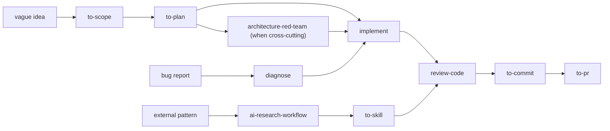

# 개인 스킬 포트폴리오 분류와 로드맵

상태: 방향 승인, 후속 스킬은 각각 별도 구현 계획 필요

마지막 검토: 2026-07-22

## 결정

- `to-scope` 하나가 누락 검토와 범위 최소화를 소유한다.
- Ponytail, `grill-me`, `grilling`, Caveman은 runtime dependency가 아니라 pinned provenance와 설계 참고 자료로만 사용한다.
- workflow는 외부 스킬을 호출해 이어 붙이지 않고, owned skill이 만든 명시적인 산출물을 다음 owned skill이 입력으로 받는 방식으로 조합한다.
- 분류는 embedding이나 vector database가 아니라 비교 가능한 범주형 feature vector로 유지한다. 두 번째 기계 소비자가 생기기 전에는 별도 catalog schema를 만들지 않는다.
- 새 스킬은 한 번에 하나씩 추가한다. trigger, 비책임, 부작용, 종료 조건과 eval이 독립적으로 설명되지 않으면 기존 스킬의 규칙으로 흡수한다.

## 분류 벡터

각 스킬은 다음 축으로 비교한다.

| 축 | 값 예시 | 판단 목적 |
| --- | --- | --- |
| lifecycle | scope, plan, build, review, ship, operate, meta | workflow에서의 위치 |
| action | find, prune, transform, review, generate, mutate, orchestrate | 핵심 동작과 이름 |
| interaction | advisory, interactive, guarded, autonomous | 사용자 개입 정도 |
| side effect | `S0` 없음, `S1` 파일, `S2` local Git, `S3` remote | 권한과 중단 조건 |
| state scope | chat, filesystem, Git, network, host runtime | 읽고 쓰는 상태 |
| workflow shape | single, linear, branching, gated, iterative, orchestrator | 실행 구조 |
| autonomy | `A1` 결정 대화, `A2` guarded 실행, `A3` bounded autonomous | 실행 권한 |
| dependencies | none, owned skill, host tool, network, runtime adapter | 독립성과 portability |
| output | scope, plan, findings, code, commit, PR, transformed artifact | 다음 단계 handoff |
| trigger | narrow, medium, broad | implicit invocation 충돌 위험 |

## 현재 owned skill 분류

| 스킬 | phase / action | mode | effect / state | shape / autonomy | 결과 | dependency |
| --- | --- | --- | --- | --- | --- | --- |
| `to-scope` | scope / find+prune | interactive | `S0` / chat | gated / `A1` | decision-ready scope | none |
| `ai-research-workflow` | research / validate+synthesize | advisory | `S0`, 요청 시 `S1` / network | fan-out/fan-in / `A3` | cited decision 또는 report | source tools, no fixed provider |
| `architecture-red-team` | review / challenge+gate | advisory | `S0` / files read-only | linear gate / `A3` | architecture verdict | none |
| `to-skill` | meta / create+normalize | guarded | `S1` / filesystem | branching / `A2` | portable skill package | validators, optional host adapter |
| `to-commit` | ship / partition+commit | guarded | `S2` / Git | iterative / `A2` | verified commits | Git |
| `to-pr` | ship / draft+publish | guarded | draft `S0`, publish `S3` / Git+network | branching gate / `A2` | PR copy 또는 URL | owned `to-commit`, GitHub workflow |

현재 강점은 scope, 근거 조사, architecture gate, skill authoring과 Git publication이다. 빈 구간은 plan, implementation, diagnosis, ordinary code review와 post-PR integration이다.

## 외부 패턴 분류와 반영 결정

### Ponytail

벡터: build 전반 / prune+minimize / advisory modifier / 실제 구현 시 `S1` / iterative / broad trigger.

유지할 개념은 `필요한가 → 기존 코드 → 표준 기능 → native 기능 → 기존 dependency → 최소 구현` 순서와, 보안·접근성·데이터 손실 방지·검증을 절대 제거하지 않는 경계다. 이 중 scope 판단은 `to-scope`의 `minimal` pass에 이미 반영했다.

항상 켜지는 mode, 광범위한 coding trigger, intensity와 답변 스타일 규칙은 가져오지 않는다. 구현 diff를 줄이는 discipline은 향후 `implement`에 필요한 규칙만 독립적으로 다시 작성한다.

### `grill-me` / `grilling`

벡터: scope 전 / find decisions / one-question interactive / `S0` / iterative gate / `A1`.

`grill-me`는 reusable `grilling` loop를 여는 얇은 사용자 진입점이다. 핵심은 환경에서 확인 가능한 사실은 직접 조사하고, 실제 결정만 한 번에 하나씩 추천안과 함께 묻고, 합의 전에는 실행하지 않는 것이다. 이 개념은 `to-scope`의 `complete` pass에 이미 반영했다.

owned `grill-me` wrapper나 `grilling` 복제본은 만들지 않는다. `grill-with-docs`의 domain glossary와 ADR 작성은 별도 책임이며 `to-scope`가 대체하지 않는다.

### Caveman

| upstream pattern | 벡터 요약 | 결정 | owned 이름 또는 반영 위치 |
| --- | --- | --- | --- |
| response compression | meta / transform / chat state / iterative | 사용 빈도가 확인되면 opt-in으로 추가 | `tighten-output` |
| concise commit | ship / generate / `S0` | 새 스킬을 만들지 않음 | `to-commit` 메시지 규칙에 흡수 |
| concise review | review / format / `S0` | code review가 생길 때 형식만 흡수 | `review-code` |
| file compression | operate / transform / `S1`+external data | 안전 계약을 설계한 뒤 후순위 | `compress-instructions` |
| usage stats | operate / measure / host state | cross-host event 계약 전에는 만들지 않음 | runtime tool 후보 |
| Cavecrew routing | meta / orchestrate / mixed effects | underlying owned skills가 안정된 뒤 추가 | `route-work` |
| help card | meta / generate / `S0` | 새 스킬을 만들지 않음 | manifest에서 문서 생성 |

가져올 공통 패턴은 정확한 trigger와 non-goal, compact receipt, 명시적 refusal/stop token, 보안·파괴적 작업의 clarity override, mutator의 preflight/backup/readback/validate/restore, deterministic parser를 model 밖에 두는 원칙이다.

host hook, transcript format, 특정 model 이름, Claude 전용 도구 이름, upstream benchmark 수치와 branding은 가져오지 않는다. 특히 파일 압축은 content-level secret 검사, 외부 전송 동의, atomic restore와 실제 validator가 준비되기 전에는 구현하지 않는다.

## 이름 규칙

- `to-*`: 입력을 안정적인 terminal artifact나 상태로 바꾸는 workflow에만 사용한다. 예: `to-scope`, `to-plan`, `to-commit`, `to-pr`, `to-skill`.
- 동작형: 지속적인 판단, 검토, 진단, routing과 변환에는 짧은 동사를 사용한다. 예: `diagnose`, `review-code`, `route-work`, `tighten-output`, `compress-instructions`.
- upstream 이름, 캐릭터명과 내부 기법을 owned 이름에 남기지 않는다.
- `find-gaps`와 `prune-scope`는 두 개 이상의 owned workflow가 독립적으로 재사용할 때만 `to-scope`에서 분리한다.

## 목표 workflow

`route-work`는 이 graph의 endpoint가 아니라, 입력 상태와 artifact를 보고 다음 owned skill을 선택하는 얇은 router다. `to-plan`, `diagnose`, `implement`와 `review-code`가 안정되기 전에는 만들지 않는다.

## 우선순위

### P0 — 완료

1. `to-scope`: Ponytail식 최소화와 grilling식 누락 결정을 하나의 독립 workflow로 내재화.
2. active catalog에서 중복 refinement provider 제거.
3. upstream revision, license와 채택 개념을 `catalog/adaptations.json`에 기록.

### P1 — 다음 세 스킬

1. `to-plan`: accepted scope를 ordered implementation plan과 검증 지점으로 변환한다. architecture verdict나 code mutation은 하지 않는다.
2. `diagnose`: 증상을 재현하고 원인을 좁혀 evidence-backed diagnosis를 만든다. 별도 수정 요청 없이는 구현하지 않는다.
3. `review-code`: ordinary diff를 correctness, security, maintainability와 test sufficiency 기준으로 read-only 검토하고 merge-readiness를 판정한다.

각 스킬은 별도 계획과 PR로 구현한다. 셋을 router나 하나의 대형 workflow로 묶지 않는다.

### P2 — 실행과 조합

1. `implement`: accepted plan이나 명확한 task를 최소한의 검증된 변경으로 구현한다.
2. `route-work`: 안정된 owned skill 사이만 routing하고 compact receipt를 사용한다.
3. `tighten-output`: 사용자 opt-in인 chat-only 변환으로 만들고 기술 literal과 clarity override를 보존한다.

### P3 — 위험하거나 host-dependent한 기능

1. `compress-instructions`: explicit consent, secret boundary, backup/restore와 structural validator가 준비된 뒤 검토한다.
2. `finish-branch`: review 대응, merge, branch cleanup과 release handoff의 범위를 따로 확정한다.
3. usage telemetry: cross-host event schema와 실제 측정 가능성이 생긴 뒤 runtime tool로 검토한다.
4. `model-domain`: glossary/ADR가 반복적으로 필요하다는 사용 근거가 생길 때 별도 scope로 검토한다.

## 외부 의존성 차단 규칙

owned adaptation은 다음 조건을 모두 만족해야 한다.

1. runtime `SKILL.md`는 upstream skill, plugin, hook, command, checkout 또는 network를 요구하지 않는다.
2. upstream은 full SHA, license, 검토 경로와 채택 개념만 provenance에 남긴다.
3. 문구, branding, script와 host adapter를 복사하지 않고 행동 계약을 독립적으로 작성한다.
4. 같은 trigger의 external provider와 owned provider를 동시에 지원 구성으로 두지 않는다.
5. host-specific 기능은 portable core와 adapter를 분리한다.
6. side effect가 있는 스킬은 preflight, validation, stop condition과 recovery를 명시한다.

이 저장소는 user-global external skill을 자동 삭제하거나 disable하지 않는다. 현재 global `grill-me`, Ponytail과 `grill-with-docs` 설치는 사용자가 owning host에서 직접 정리해야 하며, `grill-with-docs`는 owned replacement가 없는 별도 capability로 취급한다.

## 새 스킬 승인 기준

새 owned skill은 구현 전에 다음을 만족해야 한다.

- 현재 owned skill과 겹치지 않는 한 문장 책임이 있다.
- positive trigger와 near-miss negative trigger를 각각 정의한다.
- 입력 artifact, terminal output과 다음 workflow handoff가 명확하다.
- side-effect 등급과 사용자 승인 경계가 명확하다.
- external runtime dependency가 없거나 host adapter로 격리된다.
- 가장 작은 static validation과 대표 forward eval이 있다.
- 별도 evaluator framework, mirror와 router는 두 번째 실제 소비자가 생기기 전에는 추가하지 않는다.

## 검토한 upstream

- Ponytail: <https://github.com/DietrichGebert/ponytail/tree/16f29800fd2681bdf24f3eb4ccffe38be3baec6b>
- `grill-me` / `grilling`: <https://github.com/mattpocock/skills/tree/ed37663cc5fbef691ddfecd080dff42f7e7e350d/skills/productivity>
- Caveman v1.9.1: <https://github.com/JuliusBrussee/caveman/tree/0d95a81d35a9f2d123a5e9430d1cfc43d55f1bb0>
